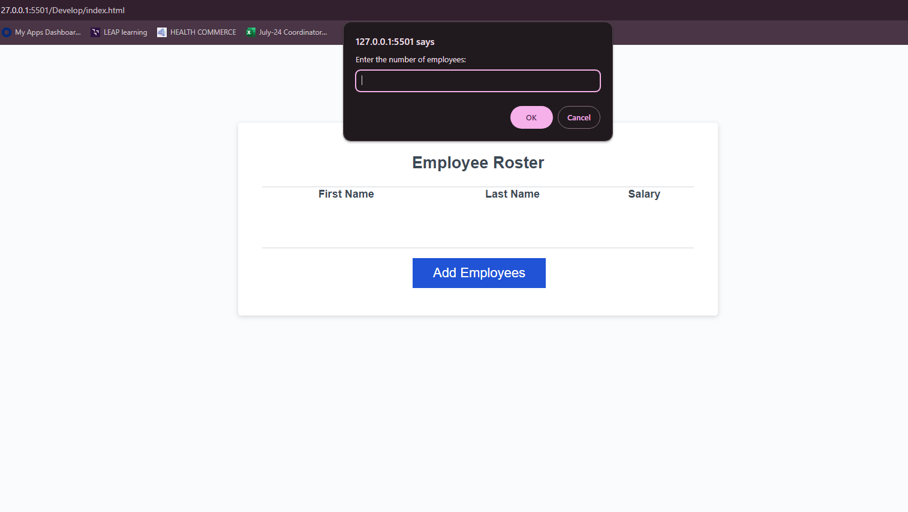
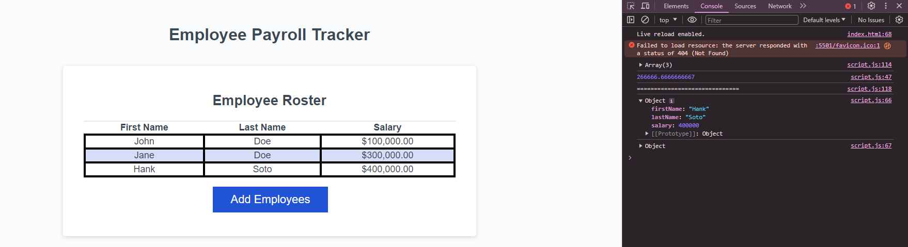

# Employee Payroll Tracker Starter Code

## Overview
This script is designed to manage employee data by allowing users to input employee information, calculate the average salary, select a random employee, and display all employee data in an HTML table.

## Screenshots



## Features
- **Collect Employee Data**: Prompt the user to input employee details.
- **Calculate Average Salary**: Compute and display the average salary of the employees.
- **Select Random Employee**: Randomly pick and display details of a selected employee.
- **Display Employees**: Show all employees in an HTML table.

## How to Use

### Clone the Repository
To get started, clone this repository using the following command:
```sh
git clone https://github.com/yourusername/employeemanager.git


### Resources

This project was made possible with the help of various resources and contributions from team members.

- **Websites**: 
  - [MDN Web Docs](https://developer.mozilla.org/)
  - [W3Schools](https://www.w3schools.com/)
- **iPhone App**: 
  - [JavaScript Code Editor]
- James
- Stephen
- Nick
- Erica

### Special Thanks

To the following Classmate and teacher for helping crack a few codes and the lessons that helped me understand this project. 
- **Michael F**:
